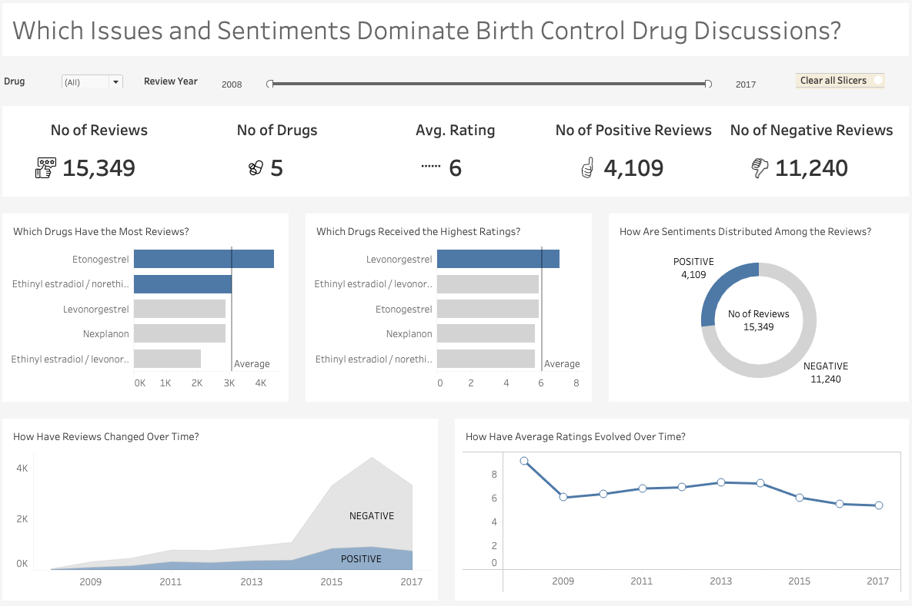
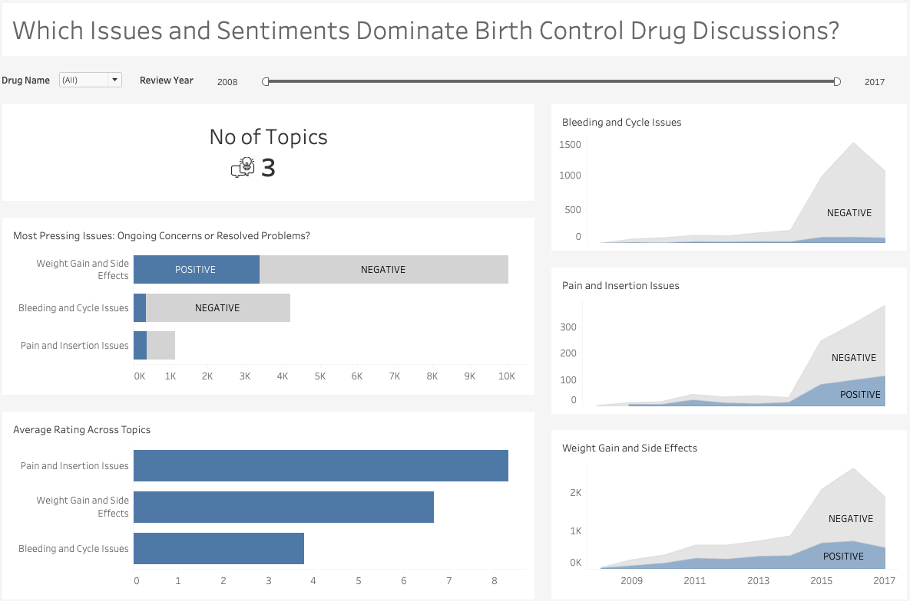
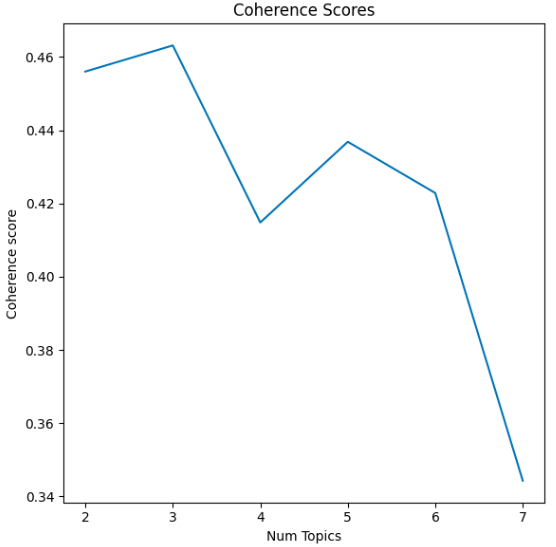

# Birth Control Drug Reviews Analysis

Birth control drugs are among the most reviewed on Drugs.com, likely due to the high likelihood of uncomfortable side effects associated with them. My motivation for this project is to analyze reviews for popular birth control drugs on Drugs.com to provide insights into user experiences with these options.

## Project Overview

The goal is to explore the sentiments and topics discussed in birth control drug reviews. Initially, the plan was to scrape data directly from Drugs.com. However, a pre-scraped dataset containining 15,349 birth control drug reviews was found on UCI ML ([Drug Review Dataset](https://archive.ics.uci.edu/dataset/462/drug+review+dataset+drugs+com)) spanning 2008-2017, which was sufficient for exploratory analysis and proof of concept. The dataset also contains user ratings ranging from 1 to 10 and was collected between 2008 and 2017.

To achieve the overarching goal, several techniques were employed:

1. **Sentiment Analysis**: Analyzing the sentiment of reviews using a fine-tuned DistilBERT model. Reviews were grouped into positive and negative categories.
2. **Topic Modeling**: Identifying prevalent topics or themes in the reviews using Latent Dirichlet Allocations (LDA) topic modeling. This helps in understanding what users are actually discussing about the medication.
3. **Visualization**: Creating an interactive dashboard in Tableau to present insights from the analysis in a clear and accessible manner.

## The Resulting Dashboards

The report consists of two pages: an overview page and a detailed topic analysis page.

- **Overview Dashboard**: Summarizes key metrics and provides a broad view of the overall review data and discerned sentiments. It shows metrics such as the number of reviews, average ratings, number of drugs, and the distribution of positive and negative reviews. It also compares these metrics across different drugs and time periods, allowing for detailed comparisons. See the overview page below:

  

- **Detailed Topic Analysis Dashboard**: Offers an in-depth examination of the identified topics in the reviews. It features metrics such as the number of topics and the distribution of sentiments within each topic. This helps to determine whether users are discussing ongoing issues (negative sentiment) or resolved issues (positive sentiment). For instance, a review mentioning that bleeding and side effects have stopped after using the drug reflects a positive sentiment, even though the topic may appear problematic. The page also includes average ratings across topics and temporal analysis to show how sentiment distribution has evolved over time. See the topic analysis page below:

  

# Summary of Learnings

The analysis of the 15,349 birth control drug reviews from Drugs.com provided the follwoing key insights into user experiences and sentiments:

## Sentiment Distribution

- The majority of reviews were negative, with 11,240 negative reviews compared to 4,109 positive reviews. This indicates a general dissatisfaction among users, primarily due to side effects.

## Key Themes

- **Weight Gain and Side Effects**: Many users reported concerns about weight gain and other side effects.
- **Bleeding and Cycle Issues**: A significant number of reviews highlighted problems related to bleeding and menstrual cycles.
- **Pain and Insertion Issues**: Users frequently discussed pain, particularly related to drug ingestion or device insertion.

  It is important to note that even within these common issues, some reviews discuss the resolution of these problems, reflecting positive sentiments despite the problematic topics.

## Drug Comparisons

- **Most Reviewed Drugs**: Etonogestrel and Ethinyl estradiol/norethindrone were the most reviewed drugs.
- **Highest Ratings**: Levonorgestrel received the highest average ratings among the drugs analyzed.
- **Ethinyl Estradiol/Norethindrone**: This combination was frequently associated with weight gain and side effects, as well as bleeding and cycle issues, possibly due to its oral route of administration.
- **Highest Proportion of Positive Sentiments**: Levonorgestrel had the highest proportion of positive reviews, with 30% (878 out of 2,884) of reviews being positive.This is interesting because it also the drug with the highest user ratings. It had the highest average user rating of 7, which is higher than the overall average rating of 6.
- **Highest Proportion of Negative Sentiments**: Nexplanon had the highest proportion of negative reviews, with 77% (2,222 out of 2,883) of reviews being negative.

## Trends Over Time

- **Review Volume**: There was a noticeable increase in the number of reviews over time, peaking around 2015. This suggests a growing user engagement and reporting on birth control experiences.
- **Sentiment Shifts**: The proportion of negative reviews increased significantly over the years, indicating that more users experienced adverse effects or were motivated to report negative experiences.
  
- The increase in negative sentiments over time warrants further investigation to determine whether this trend is due to more people adopting these medications, which could reveal variations in how different individuals react to the medications (pharmacodynamics).

These insights offer valuable perspectives for healthcare stakeholders, aiding in understanding user experiences and improving birth control drug options.

## Sentiment Analysis Technique

For sentiment analysis, the fine-tuned [distilbert-base-uncased-finetuned-sst-2-english](https://huggingface.co/distilbert/distilbert-base-uncased-finetuned-sst-2-english) model on Hugging Face was used, achieving state-of-the-art accuracy of 91.3% on the SST-2 dataset. This model was employed to predict the sentiment of each review, with confidence scores obtained to validate the predictions. The preprocessing steps were managed through the pipeline library available in the Transformers library, which handles essential preprocessing tasks. HTML tags were found and removed from the texts, but stop words were not removed as the transformer-based model handles them and requires them for contextual understanding.

## LDA Topic Modeling

Latent Dirichlet Allocation (LDA) was used for topic modeling due to its simplicity and effectiveness. The process involved robust preprocessing to achieve good coherence in the resulting topics. The following steps were taken:

1. **Text Preprocessing**:
   - Converted text to lowercase.
   - Removed multiple white spaces and line breaks.
   - Tokenized the text into individual words using NLTK’s `word_tokenize`.
   - Removed non-alphabetic tokens.
   - Used NLTK's stopword list and added custom stopwords.
   - Removed stopwords from the tokenized text.
   - Created bigrams and trigrams using Gensim's `Phrases` and `Phraser`.
   - Lemmatized the text using SpaCy, retaining only nouns, adjectives, verbs, and adverbs.
   - Applied the preprocessing pipeline to the DataFrame's `review` column.
   - Created a dictionary (`id2word`) and filtered extremes to remove words appearing in fewer than 50 documents or more than 50% of the documents.
   - Created a corpus representing each document as a list of tuples with word IDs and their frequencies.

2. **Topic Selection**:
   - Selected the number of topics based on coherence and perplexity scores.
   - Chose three topics due to their high coherence score of 0.46, despite high perplexity, based on manual review of representative documents.

  

## Topics Inferred from the Reviews

- **Topic 1: "Weight Gain and Side Effects"** - Reviews often mentioned terms like weight and gain, focusing on the impact of the drug on weight and other side effects.
- **Topic 2: "Bleeding and Cycle Issues"** - Reviews discussed terms such as bleeding and cramps, relating to the drug's effect on bleeding and menstrual cycle issues.
- **Topic 3: "Pain and Insertion Issues"** - Reviews highlighted pain and discomfort, particularly related to drug ingestion or the insertion of devices.

## Threats to Validity and Next Steps

- Currently, the insights might be biased as they are obtained from a single source. Acquiring data from multiple sources would provide a more representative sample and, in turn, more robust insights. 
- Further investigation is recommended to understand the reasons behind the drastic increase in the proportion of negative sentiments over the years.

## Access the Dashboards
You can interact with the dashboards using the following link: [Which Issues and Sentiments Dominate Birth Control Drug Discussions](https://public.tableau.com/views/WhichIssuesandSentimentsDominateBirthControlDrugDiscussions/Overview?:language=en-US&:sid=&:redirect=auth&:display_count=n&:origin=viz_share_link).

